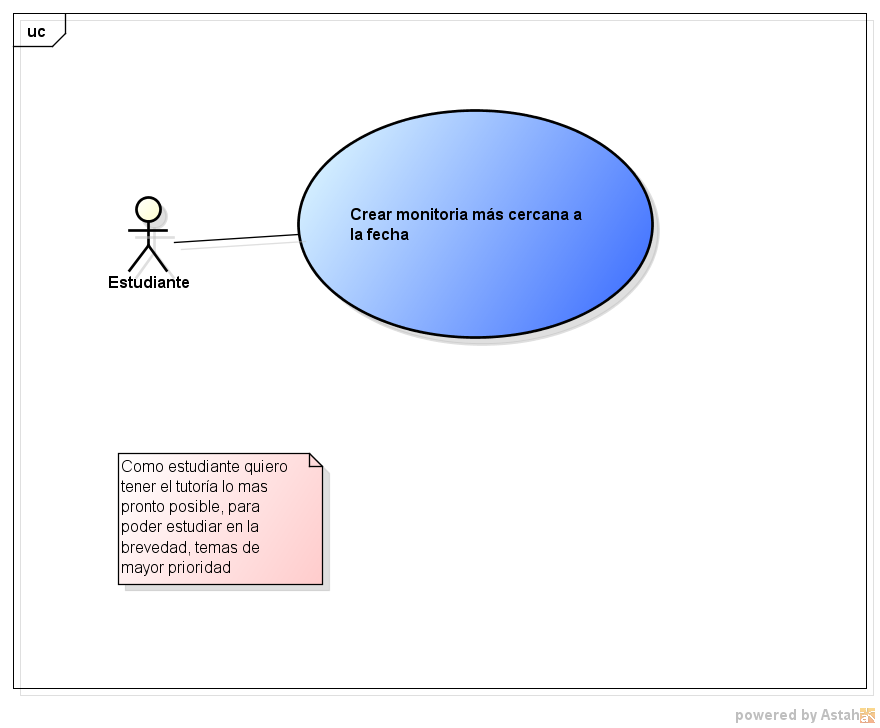

### DOSW_ParcialT1_Juan_Rivera
## Requerimientos Funcionales
1. Se descartan tutores no disponibles y se selecciona el que tenga el horario libre más próximo, sin importar si es profesor o posgrado.
2. Se busca primero en la lista de profesores de esa materia; si hay disponibles, se asigna el más próximo. Si no hay profesores
3. El estudiante prefiere aprender de otro estudiante. Se descartan
los profesores por completo y se selecciona el estudiante de posgrado disponible que
pertenezca al mismo programa académico del solicitante.

## Requerimientos no Funcionales
1. La interfaz debe ser responsive
design a dispositivos móviles y de escritorio.
2. El diseño debe incorporar la identidad visual institucional, respetando la paleta de colores oficial del programa de Ingeniería de Sistemas de la Escuela y empleando una tipografía legible que cumpla con los estándares mínimosde contraste y accesibilidad web (WCAG 2.1 Nivel AA) para facilitar la lectura de horarios y
perfiles de tutores.

## Historias de usuarios- Funcionales
# FASTEST_AVAILABLE 
 Campo | Descripción |
|------|-------------|
| **ID** | RF-01 |
| **Nombre del requerimiento** |Creación con prioridad tiempo |
| **Descripción** |Como estudiante quiero tener el tutoría lo mas pronto posible, para poder estudiar en la brevedad, temas de mayor prioridad.|
| **Precondiciones** |  Haber tutorores libres y con las siguientes condiciones de aceptación:
- Efectivamente selecciona el tutor disponible más cercano.
  - Que no escoja uno que ya esta seleccionado.
  - Que escoga independiente mente si es profesor o de posgrado.
  - que tengan la duración adecuada.|
| **Actor** | Estudiante|
| **Flujo principal** | 1. El actor ingresa digita FASTEST_AVAILABLE . 2. El sistema le muestra las opciones acordes a su elección. 3.El estudiante selecciona la mas conveniente. |
| **Diagrama de caso de uso** | |
| **Poscondiciones** | La sesión queda agendada para aceptación del monitor.|

 

  

# EXPERT_FIRST 

 Campo | Descripción |
|------|-------------|
| **ID** | RF-02 |
| **Nombre del requerimiento** |Creación con prioridad de Profesor seguido de Posgrado|
| **Descripción** |Como estudiante quiero priorizar la seleccion de monitories de esa materia a primera instancia, en segunda estudiantes de posgrado, para poder maximizar mi aprendizaje.|
| **Precondiciones** |  Haber tutorores libres y con las siguientes condiciones de aceptación:
- Efectivamente selecciona el tutor disponible más cercano.
 - Que solo inscriba a estudiante de posgrados si todos los profesores disponibles en el criterio del estudiante estan ocupados.
 - Que escoga con esse orden de prioridad.
 - Que no escoja uno que ya esta seleccionado.
 - que tengan la duración adecuada.|
| **Actor** | Estudiante|
| **Flujo principal** | 1. El actor ingresa digita EXPERT_FIRST  . 2. El sistema le muestra las opciones acordes a su elección. 3.El estudiante selecciona la mas conveniente. |
| **Diagrama de caso de uso** ||
| **Poscondiciones** | La sesión queda agendada para aceptación del monitor.|

# PEER_TUTORING
 Campo | Descripción |
|------|-------------|
| **ID** | RF-03 |
| **Nombre del requerimiento** |Creación con únicamente monitor de Posgrado|
| **Descripción** |Como estudiante quiero crear sesiones de monitoria exclusicamente con tutores de posgrado.|
| **Precondiciones** |  Haber tutorores libres y con las siguientes condiciones de aceptación:
 - Que excluya totalmente a los profesores.
 - No se sobreescriban las sesiones
 - que tengan la duración adecuada|
| **Actor** | Estudiante|
| **Flujo principal** | 1. El actor ingresa digita PEER_TUTORING  . 2. El sistema le muestra las opciones acordes a su elección. 3.El estudiante selecciona la mas conveniente. |
| **Poscondiciones** | La sesión queda agendada para aceptación del monitor.|
